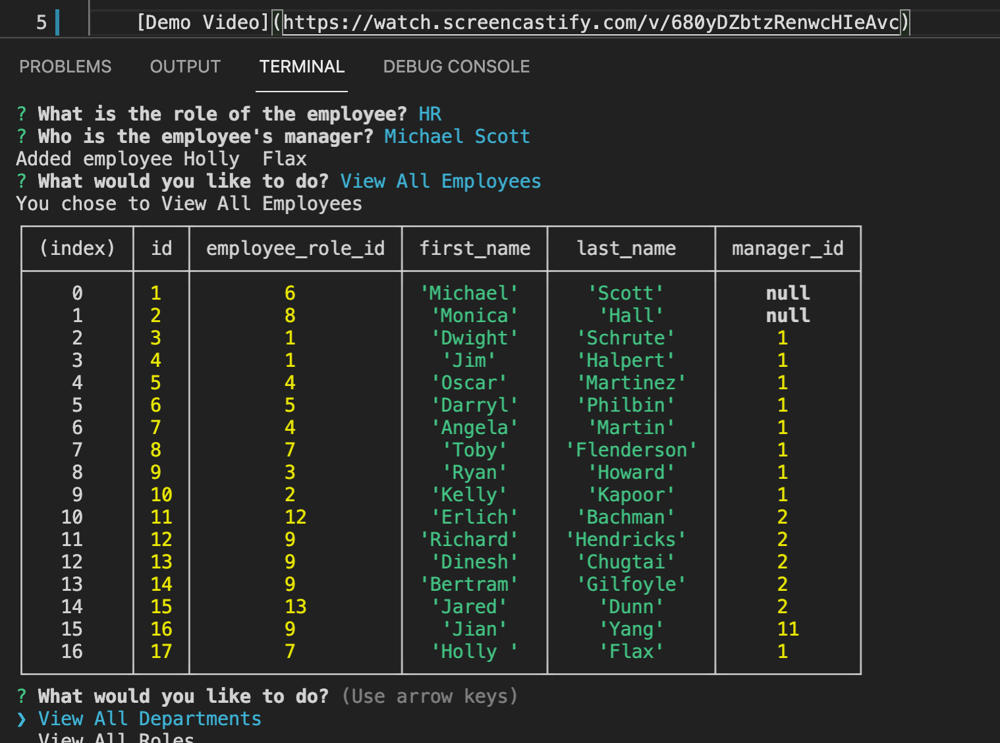
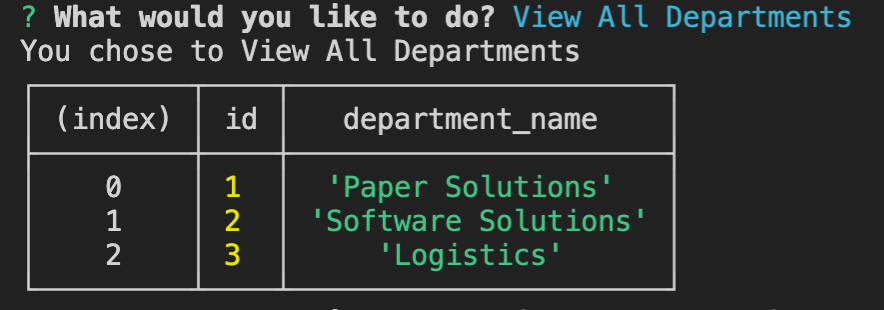
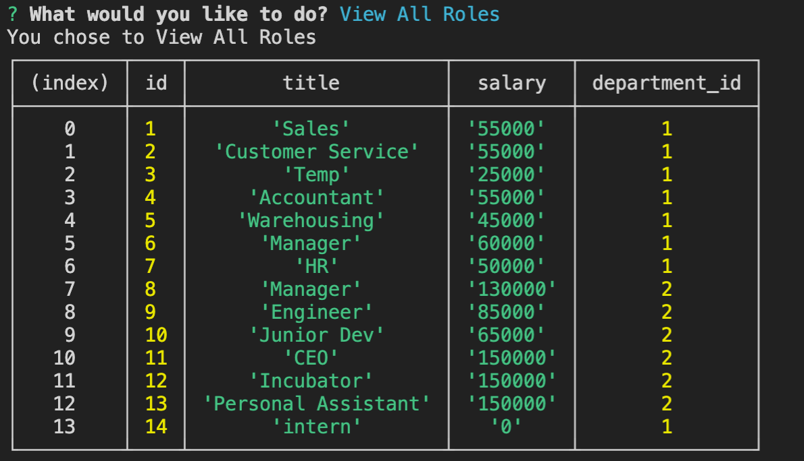

# Employee-Tracker
  ##  
  ## 
  ## 
 ## [Demo Video](https://watch.screencastify.com/v/680yDZbtzRenwcHIeAvc)

  ## Licensing:
  
  ## Table of Contents: 
  - [Description](#description)
  - [Technology](#technology)
  - [Usage](#usage)
  - [Questions](#questions)

  ## Description:
  This command-line content management system application uses Node.js, Inquirer and MySql to manage a relational database comprised of department, role and employee tables.  
  ## Technology:
  Node.js, Inquirer, MySql, JS
  ## Usage: 
  The user is presented with a variety of choices ragarding the database.  When the user selects view all departments, roles and employees those repsective tables are displayed in a formatted manner inside the terminal.  The user may also choose to add a department.  They are then prompted to simply add the name of the department.  If the user chooses to add a role in the company, they are prompted to enter the na,e, salaray and department for this new role.  If the user chooses to add an employee, they are prompted to enter the employee's first name, last name, role, and manager.  If the user chooses to update an employee role, they are prompted to select an employee from the table to update and the new information is updated.   
  ## License: 
  None Provided 
  ## Questions: 
  lmc@uga.edu
  
  <https://github.com/tripledawg>